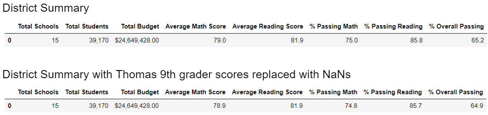

# School District Analysis 

## Overview of the school district analysis: 
Using tools in the Pandas library, we analyized school and student academic data of the PyCity school district.  The analysis focus on whether there are correlation between academic performance and school type, funding ,and size.  We then look at if academic data of Thomas High School's ninth graders contain any signs of academic dishonesty by replacing the scores in question with NaNs. 

## Results:

* District Summary: 
Replacing scores of Thomas High School's 9th graders with NaNs resulted in slightly lower academic passing rate for the district.  For math it lowered from 75% to 74.8%. For reading, it lowered from 85.8% to 85.7%.  This also resulted in lower overall passing rate from 65.2% to 64.9%. 

 
 

* School Summary: 
Replacing Thomas High School 9th grader scores has no affect on the results of other high schools in the district (see school summary for every school in the Per School Summary table in below Thomas High School segment).  
 

* Thomas High School Performance: 
Replacing 9th grader scores with NaNs lower the overall Thomas High School academic results slightly.  The green box in the table below highlighted Thomas High School's performance before the score replacement data treatment.  One can compared these results to the overall Thomas High School performance after replacing 9th graders' scores shown below the summary table. 

 

* Other affect: 

    *Math and reading scores by grade* - replacing Thomas High School 9th grader's scores has no impact to averages in all other high schools and grade.  The impact is isolated to only Thomas High School 9th grade as show in tables below.  Both of these averages are shown as NaN 
     
        
     

    *Scores by school spending* - We divided the entire district into four spending bins for this analysis.  with rounding, there is no affect from replacing Thomas High School scores with Nans.  
        
         

    *Scores by school size* - We divided the entire district into three size bins for this analysis.  with rounding, there is no affect from replacing Thomas High School scores with Nans. 
        
     

    *Scores by school type* - We dividing the entire district into two type bins for this analysis.  with rounding, there is no affect from replacing Thomas High School scores with Nans. 
        
     

## Summary
From this analysis we can see when we replace Thomas High School 9th grade reading and math scores with NaNs, it affected the five performance metrics we look at in many of our analysis.
   
The five performance metrics are average math score, average reading socre, % passing math, % passing reading and % overall passing. 

This five performance metrics were affected in our district level analysis.  The effect also show up in the School level analysis.  These effects would also be in the analysis of Scores by school spending, size and type.    

